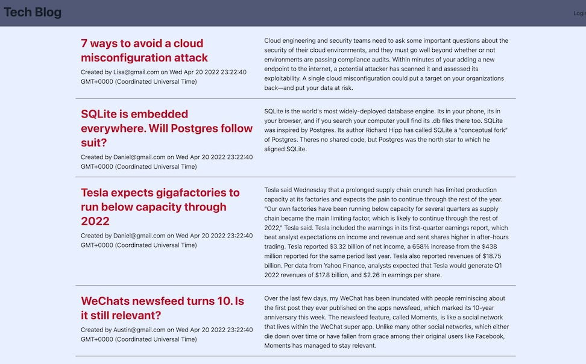

# tech-blog
-------

## Table of Content

- [Description](#description)
- [Image and Links](#image-and-links)
- [GitHub Repository](#github-repository)
- [Author](#author)  
- [Contributors and Resources](#contributors-and-resources)
- [Technologies Used](#technologies-used) 
- [License](#license)

-------
## Description:  
We were asked to build a CMS-style blog site similar to a Wordpress site, where developers can publish their blog posts and comment on other developers’ posts as well. You’ll build this site completely from scratch and deploy it to Heroku. Your app will follow the MVC paradigm in its architectural structure, using Handlebars.js as the templating language, Sequelize as the ORM, and the express-session npm package for authentication.

-------
## Image and Links:

Tech Blog Image:

- [Heroku Deployment](https://note-taker-2022-3.herokuapp.com/)

----
## Github Repository:

- [Github Repository for Tech Blog](https://github.com/ksjefferies/tech-blog)

## Author:

- [Kelly Jefferies](https://github.com/ksjefferies)

## Contributors and Resources:

- Daniel Norred

## Technologies Used:
- Javascript
- express
- express-handlebars
- MySql2
- sequelize
- dotenv
- bcrypt
- express-session
- connect-session-sequelize 
- Nodemon
- TailwindCss

## License:

